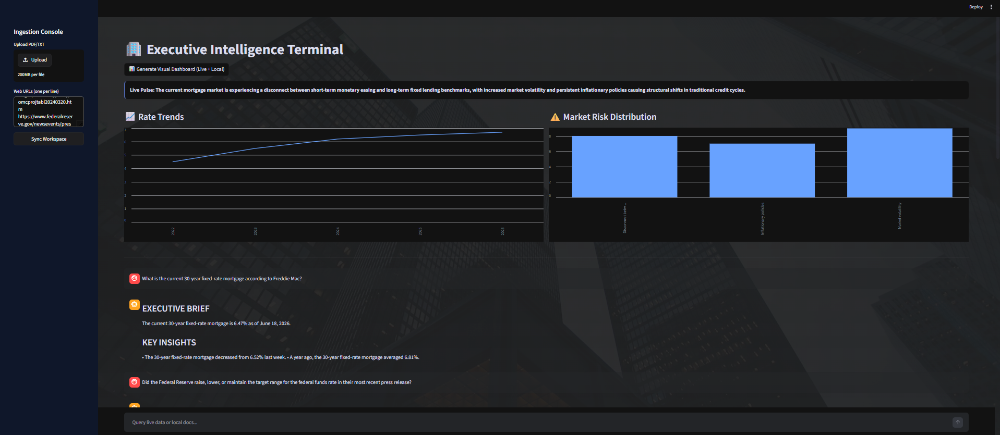
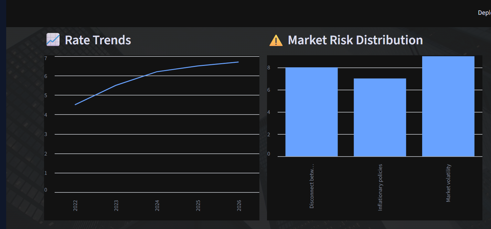

# 🏢 AI Real Estate Intelligence Platform
### Session-Isolated Multi-Tenant RAG Application for Housing Market Analysis & Visual Intelligence

[](https://opensource.org/licenses/MIT)
[](https://www.python.org/)
[](https://streamlit.io/)
[](https://www.langchain.com/)

---

## 📌 Overview
The **AI Real Estate Intelligence Platform** is a Retrieval-Augmented Generation (RAG) application that helps users analyze housing market reports, property documents, and market information using Large Language Models (LLMs).

Users can upload PDF reports or provide web URLs. The system retrieves relevant information from session-isolated vector stores, enriches responses with live web context, and generates structured, visualization-ready insights through an interactive Streamlit dashboard.

This project was built to explore practical GenAI concepts including:
* Retrieval-Augmented Generation (RAG)
* Vector Databases & Embeddings
* Session-Level Data Isolation
* Structured LLM Outputs with Pydantic
* Hybrid Retrieval Pipelines
* Interactive Data Visualization

---

## 🎯 Project Goal
Build a RAG system capable of:
* Parsing and indexing multi-page housing market documents.
* Combining document knowledge with live web information.
* Maintaining session-level data isolation.
* Transforming LLM outputs into structured data for visualization.

This project was built to gain hands-on experience with modern GenAI application development patterns.

---

## 🚀 What This Project Demonstrates
This project demonstrates practical experience with:
* Building end-to-end RAG pipelines.
* Working with vector databases and embeddings.
* Designing retrieval workflows.
* Validating LLM outputs using Pydantic.
* Combining local knowledge bases with live web context.
* Developing interactive AI applications with Streamlit.

---

## 🧠 Architecture Decision

### Why Dedicated ChromaDB Collections Per Session?
Instead of storing all vectors inside a single shared collection and relying on metadata filters (`tenant_id == current_user`), each user session initializes its own isolated ChromaDB collection. 

> #### 🟢 Advantages
> * **Clear Retrieval Boundaries:** Completely eliminates the risk of query metadata misconfigurations exposing cross-user text records.
> * **Easier Cleanup and Debugging:** Allows direct collection-level drops (`client.delete_collection`) when a session ends without sweeping an entire shared database.
> * **Reduced Risk of Leakage:** Data separation is managed cleanly at the application boundary level rather than evaluated via post-filtering rules.
>
> #### 🔴 Tradeoffs
> * **Management Overhead:** Higher management footprint required to initialize and route collection tracking pointers dynamically.
> * **Resource Footprint:** Less memory-efficient than a centralized, unified production database index at a massive enterprise scale.

---

## ✨ Key Features
* **Session-Isolated Vector Storage:** Dedicated ChromaDB collection per user session using runtime-generated tenant IDs.
* **Hybrid Retrieval Engine:** Combines semantic vector database search with live web search queries.
* **Structured Output Pipeline:** Rigid Pydantic models validate raw model outputs before sending data fields to the charts.
* **Interactive Dashboard:** Displays live timeline trend charts, key metric indicators, and descriptive insights.
* **Live Web Context Integration:** Responses are constantly cross-referenced and enriched with real-time web context.
* **Error Handling:** Built-in fallback structures to ensure frontend stability during third-party API or rate-limiting events.

---

## 📐 System Flow

```mermaid
flowchart TD
    A[Documents / URLs] --> B[Text Extraction & Chunking]
    B --> C[HuggingFace Embeddings]
    C --> D[Session-Isolated ChromaDB]
    D --> E[Hybrid Retrieval]
    F[Live Web Search] --> E
    E --> G[Llama-3.3-70B-Versatile via Groq]
    G --> H[Pydantic Structured Output]
    H --> I[Streamlit Dashboard]

## 🛠️ Technology Stack

| Layer               | Technology              | Purpose                                                               |
| ------------------- | ----------------------- | --------------------------------------------------------------------- |
| **Frontend**        | Streamlit               | Interactive dashboard layout and UI components                        |
| **Orchestration**   | LangChain Core          | RAG pipeline configuration and tool execution routing                 |
| **LLM**             | Llama-3.3-70B-Versatile | Analytical reasoning, summarization, and structured output generation |
| **Inference**       | Groq                    | Low-latency model inference                                           |
| **Vector Database** | ChromaDB                | Embedding storage and retrieval                                       |
| **Embeddings**      | all-MiniLM-L6-v2        | Sentence embedding generation                                         |
| **Validation**      | Pydantic                | JSON schema validation and type enforcement                           |
| **Search**          | DuckDuckGo Search       | Live web context retrieval                                            |
| **Data Processing** | Pandas                  | Data transformation and visualization support                         |

---

## 📸 Screenshots

### Dashboard View



### Market Intelligence Report



---

## 📁 Repository Structure

```text
real-estate-intelligence/
│
├── main.py                 # Streamlit UI layout and application orchestration
├── rag.py                  # RAG mechanics, tool setups, and Pydantic validation schemas
├── requirements.txt        # Hardened operational dependency manifest
├── README.md               # Codebase documentation and technical specifications
├── .gitignore              # Tracking exception instructions (.env, local DB files, .venv)
│
└── assets/                 # Graphics folder for documentation media
    ├── dashboard.png
    └── report.png
```

---

## 🚀 Quick Start

### 1. Clone the Repository

```bash
git clone [https://github.com/savera1226/real-estate-intelligence.git](https://github.com/savera1226/real-estate-intelligence.git)
cd real-estate-intelligence
```

### 2. Create a Virtual Environment

#### Windows

```powershell
python -m venv .venv
.\.venv\Scripts\activate
```

#### Linux / macOS

```bash
python -m venv .venv
source .venv/bin/activate
```

### 3. Install Dependencies

```bash
pip install -r requirements.txt
```

### 4. Configure Environment Variables

Create a `.env` file in the project root:

```env
GROQ_API_KEY=your_groq_api_key_here
```

### 5. Run the Application

```bash
streamlit run main.py
```

---

## 🌐 Deployment

The application architecture is optimized for immediate configuration and hosting on Streamlit Community Cloud.

### Required Secret

To safely run the pipeline, insert your target credential key directly inside Advanced Settings -> Secrets:

```toml
GROQ_API_KEY = "your_actual_groq_api_key_here"
```

### Deployment Steps

1. Push your repository code securely to GitHub.
2. Link your repository workspace inside share.streamlit.io.
3. Set the Main Entry Point file path to main.py.
4. Configure secrets parameters and deploy.

---

## 📈 What I Learned

* Designing clean, session-isolated data spaces inside vector tools to protect multi-user data.
* Building hybrid retrieval architectures combining local knowledge and live web search
* Enforcing structured JSON data outputs out of open-ended LLMs using Pydantic tracking models.
* Developing Streamlit-based AI applications
* Separating UI and retrieval logic into modular components (`main.py` and `rag.py`)

---

## 🔮 Future Improvements

* [ ] Multi-document comparative analysis
* [ ] Historical real estate trend forecasting
* [ ] Geographic heat map visualizations
* [ ] Automated server-side PDF report generation and compilation exports.
* [ ] Orchestrating collaborative Multi-Agent secondary research workflows.
* [ ] Pluggable user authentication constraints and persistent database storage.

---

## ✍️ Author

**KrishnaSavera**

Aspiring GenAI / Machine Learning Engineer

**Focus Areas:** Retrieval-Augmented Generation (RAG) • Large Language Models • AI-Powered Analytics • Data Engineering

Currently building practical projects to deepen my understanding of modern AI systems and machine learning workflows.

---

## 📄 License

This project is licensed under the **MIT License**.


